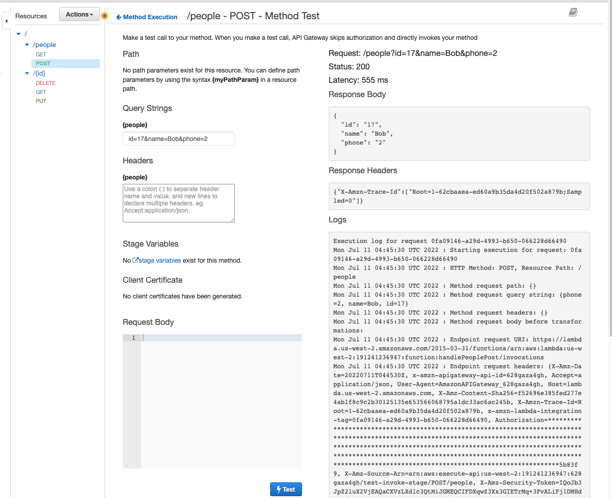
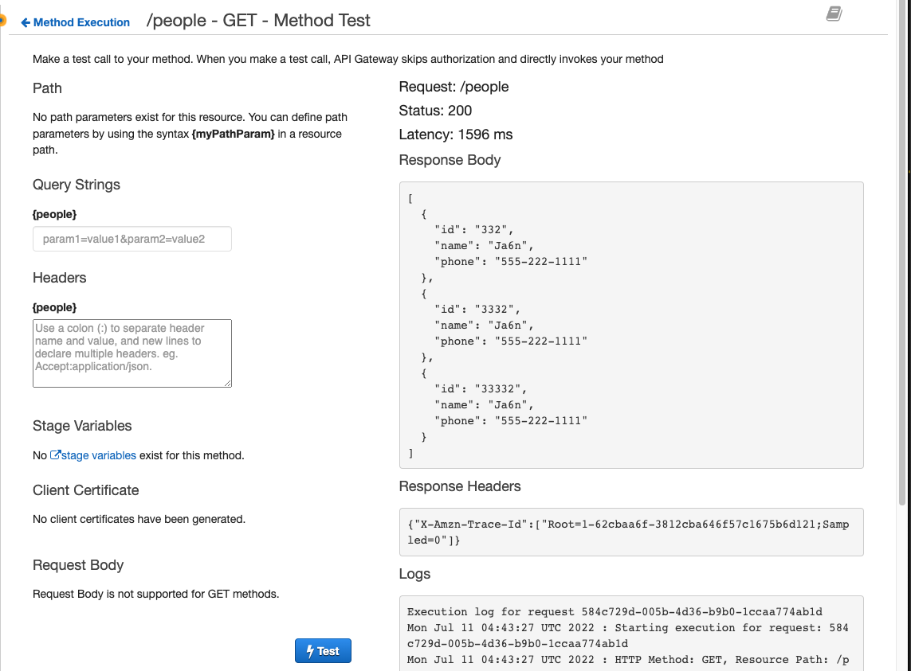
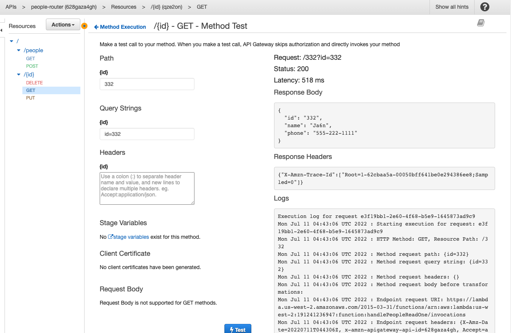
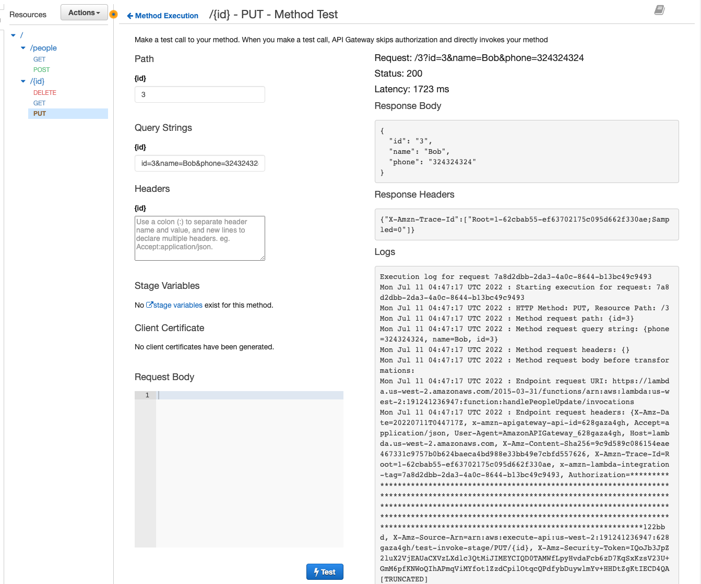
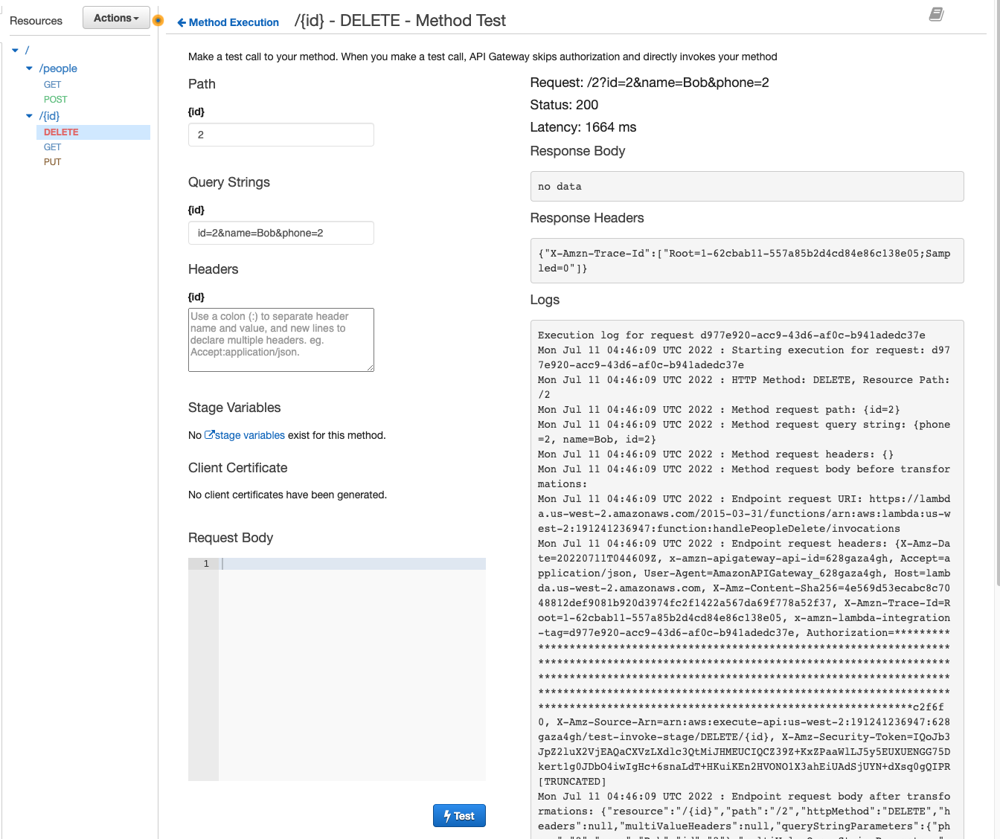

# serverless-api

## About

- Full CRUD functionality using AWS Lambda.

## Author

- Dylan Ullrich

## Process

- Create Lambda function
  1. Create function
  2. Create appropriate test, in this case: API Gateway AWS Proxy
  3. Give permissions to access Dynamo
  4. Code out function in VSCode
  5. Upload zip of function from VSCode (modules and all)
- Create appropriate API gateway
  1. Include appropriate data for function
  2. Include appropriate data to test function, and test

## Testing and Validation

### CREATE

### READ

### READ ONE

### UPDATE

### DELETE

